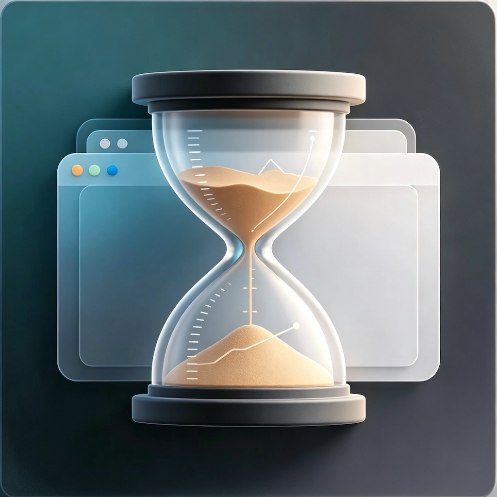

<div align="center">



# Browser Time Tracker

### macOS 本地浏览器使用时间统计工具

**按网站统计 · 按页面统计 · 日/小时图表 · 数据只留在本机**

### [官网与下载页 →](https://qteqpid.github.io/app-web/browser-time-tracker/index.html)

[](https://qteqpid.github.io/app-web/browser-time-tracker/index.html)
[](#支持平台)
[](#从源码构建)
[](#隐私和数据)
[](#支持浏览器)

</div>

## 快速开始

### 1. 下载安装包

打开下载页：

```text
https://qteqpid.github.io/app-web/browser-time-tracker/index.html
```

或直接从 GitHub Releases 下载最新的 DMG：

```text
BrowserTimeTracker.dmg
```

### 2. 安装到 Applications

双击打开 DMG，把 `Browser Time Tracker.app` 拖到 `Applications`。

### 3. 启动应用

从 `Applications` 打开 `Browser Time Tracker`。菜单栏出现沙漏图标后，应用开始运行。

### 4. 打开 Dashboard

点击菜单栏沙漏图标，选择 `Open Dashboard`。

本地 Dashboard 地址：

```text
http://127.0.0.1:38888/dashboard
```

---

## 为什么需要它？

macOS 自带的屏幕使用时间可以告诉你 Chrome、Safari 或 Edge 打开了多久，但它通常不会告诉你这些时间具体花在了哪些网站和网页上。

Browser Time Tracker 会在本机记录当前前台浏览器的活跃网页，并把时间聚合到网站、页面、日期和小时维度。它适合用来复盘自己的网页使用习惯，而不是做云端同步或团队监控。

## 核心功能

| | |
|---|---|
| **网站级统计** | 按域名统计 Top Websites，知道时间主要花在哪些网站 |
| **页面级统计** | 按页面标题和 URL 统计 Top Pages，看到更细的使用明细 |
| **日级图表** | 展示最近 7 天的浏览器使用时间，点击某一天可切换统计窗口 |
| **小时级图表** | 展示单日 24 小时分布，点击某小时查看该小时数据 |
| **颜色区分网站** | Top 10 网站会分配固定颜色，并同步到柱状图和列表 |
| **菜单栏常驻** | 使用沙漏图标常驻菜单栏，快速打开 Dashboard、暂停、清空或退出 |
| **自动暂停** | Mac 睡眠、屏幕锁定、前台 App 不是受支持浏览器时自动暂停计时 |
| **Admin Lock** | `Pause`、`Clear Data`、`Quit` 可要求管理员鉴权 |
| **本地保留 7 天** | 只保留最近一周数据，旧 session 自动清理 |

## 支持浏览器

| 浏览器 | 统计方式 | 需要权限 |
|---|---|---|
| Google Chrome | 读取当前活动标签页 URL 和标题 | Automation |
| Safari | 读取当前活动标签页 URL 和标题 | Automation |
| Microsoft Edge | 读取当前活动标签页 URL 和标题 | Automation |
| Firefox | 通过辅助功能读取地址栏信息 | Accessibility |

<details>
<summary><strong>首次权限设置</strong></summary>

### Automation

Chrome、Safari 和 Edge 需要 macOS Automation 权限。首次读取时系统通常会弹窗请求授权。

如果没有弹窗，或之前拒绝过，可以手动打开：

```text
System Settings -> Privacy & Security -> Automation
```

允许 `Browser Time Tracker` 控制你要统计的浏览器。

### Accessibility

Firefox 的 URL 读取依赖 macOS Accessibility。

请打开：

```text
System Settings -> Privacy & Security -> Accessibility
```

允许 `Browser Time Tracker`。

</details>

## 使用方式

点击菜单栏的沙漏图标：

| 菜单项 | 作用 |
|---|---|
| `Open Dashboard` | 打开本地统计页面 |
| `Pause Tracking` | 暂停或恢复统计 |
| `Clear Data` | 清空本地统计数据 |
| `Quit` | 退出应用 |

Dashboard 支持：

- 选择日期
- 选择全天或某个小时
- 点击天柱状图切换当天统计
- 点击小时柱状图切换小时统计
- 查看 Top Websites 和 Top Pages

## 隐私和数据

Browser Time Tracker 默认本地优先：

| | |
|---|---|
| **无账号** | 不需要注册，不需要登录 |
| **无云同步** | 不上传浏览记录到服务器 |
| **本地 SQLite** | 数据保存在本机 Application Support 目录 |
| **自动清理** | 只保留最近 7 天 |

本地数据库位置：

```text
~/Library/Application Support/BrowserTimeTracker/browser_time.sqlite
```

<details>
<summary><strong>数据清理策略</strong></summary>

- 应用启动时会清理一次过期数据。
- 应用运行中会定期清理过期数据。
- 超过 7 天的 session 会被删除。
- 也可以在菜单栏中使用 `Clear Data` 手动清空数据。

</details>

## 支持平台

| 平台 | 状态 |
|---|---|
| macOS 13+ | 支持 |
| iPhone / iPad | 暂不支持 |
| Windows / Linux | 暂不支持 |

## 登录后自动启动

当前 DMG 安装后需要用户首次手动打开应用。打开后应用会常驻菜单栏。

如果你是从源码运行，可以使用 LaunchAgent 脚本安装登录自启：

```bash
./scripts/install-launch-agent.sh
```

卸载登录自启：

```bash
./scripts/uninstall-launch-agent.sh
```

## 卸载

1. 从菜单栏退出 `Browser Time Tracker`。
2. 删除应用：

   ```text
   /Applications/Browser Time Tracker.app
   ```

3. 如需删除本地数据：

   ```bash
   rm -rf "$HOME/Library/Application Support/BrowserTimeTracker"
   ```

4. 如果使用过 LaunchAgent 脚本：

   ```bash
   ./scripts/uninstall-launch-agent.sh
   ```

---

## 从源码构建

### 环境要求

- macOS 13+
- Xcode 或 Xcode Command Line Tools
- Swift 5.9+

### 运行开发版本

```bash
cd mac-menubar
swift run BrowserTimeMenubar
```

### 自检

```bash
cd mac-menubar
swift run BrowserTimeMenubar --self-test
```

### 打包 DMG

```bash
NOTARY_PROFILE="btt-notary" ./scripts/package-dmg.sh
```

脚本会自动尝试读取本机 `Developer ID Application` 证书。如果有多个证书，可以手动指定：

```bash
DEVELOPER_ID="Developer ID Application: Your Name (TEAMID)" \
NOTARY_PROFILE="btt-notary" \
./scripts/package-dmg.sh
```

<details>
<summary><strong>Notarization profile</strong></summary>

如果你要分发给普通用户，建议使用 Apple notarization。

先在 Apple ID 网站生成 app-specific password，然后运行：

```bash
xcrun notarytool store-credentials "btt-notary" \
  --apple-id "your-apple-id@example.com" \
  --team-id "YOURTEAMID" \
  --password "app-specific password"
```

之后打包时传入：

```bash
NOTARY_PROFILE="btt-notary" ./scripts/package-dmg.sh
```

</details>

---

<details>
<summary><strong>English</strong></summary>

# Browser Time Tracker

A local-first macOS menu bar app that tracks how much time you spend on websites and pages.

Website and download page:

```text
https://qteqpid.github.io/app-web/browser-time-tracker/index.html
```

## Install

1. Download `BrowserTimeTracker.dmg` from the website or the latest GitHub Release.
2. Open the DMG.
3. Drag `Browser Time Tracker.app` into `Applications`.
4. Open the app from `Applications`.
5. Click the hourglass icon in the menu bar and choose `Open Dashboard`.

## Features

| | |
|---|---|
| **Website tracking** | Track time by website domain |
| **Page tracking** | Track time by page title and URL |
| **Daily chart** | Review the last 7 days |
| **Hourly chart** | Drill into a selected day by hour |
| **Menu bar app** | Open Dashboard, pause, clear data, or quit |
| **Automatic pause** | Pauses during sleep, screen lock, or unsupported foreground apps |
| **Admin Lock** | Protect Pause, Clear Data, and Quit with administrator authentication |
| **Local storage** | Data is stored locally in SQLite and retained for 7 days |

## Permissions

Chrome, Safari, and Edge use Automation permission. Firefox uses Accessibility permission.

## Local data

```text
~/Library/Application Support/BrowserTimeTracker/browser_time.sqlite
```

## Build from source

```bash
cd mac-menubar
swift run BrowserTimeMenubar
```

Package DMG:

```bash
NOTARY_PROFILE="btt-notary" ./scripts/package-dmg.sh
```

</details>
